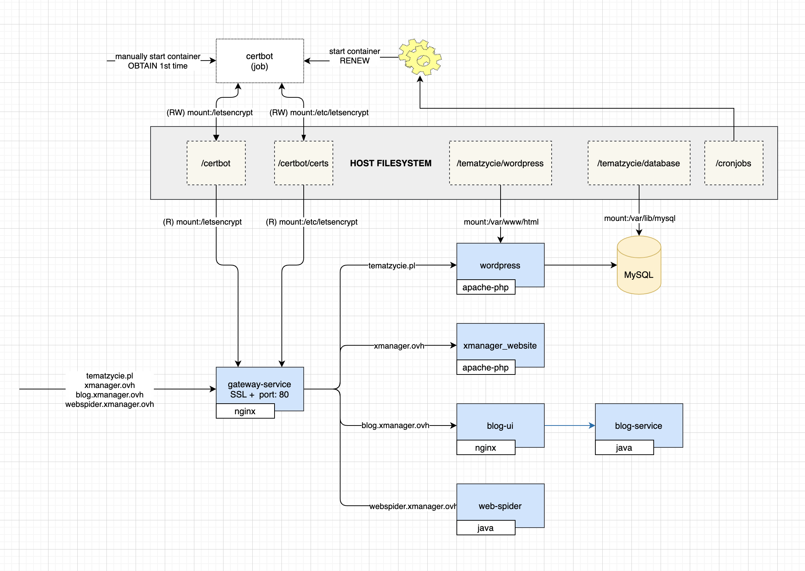

# Gateway service
Multi domain proxy with SSL port



## How to register new domain?
1) Generate new certificate using self-signed.sh script
2) Copy certificate into infrastructure/etc/letsencrypt/live/<domain>
3) Create new stub in the infrastructure/stubs/<domain>-service.html
4) Add new backend service entry into the infrastructure/docker-compose.yml
```
  <domain>-service:
    container_name: <domain>-service
    image: nginx:${NGINX_VERSION}
    volumes:
      - ./stubs/<domain>-service.html:/usr/share/nginx/html/index.html
```
5) Create new file (define backed for domain)) microservice/config/conf.d/server-<domain>.pl.conf with the following content:
```
server {
  listen 80;

  server_name   <domain> www.<domain>;
  access_log    /var/log/nginx/server-<domain>.pl.access.log main;

  return 301 https://$server_name$request_uri;
}

server {
  listen 443 ssl;
  listen [::]:443 ssl;

  ssl_certificate        /etc/letsencrypt/live/<domain>/fullchain.pem;
  ssl_certificate_key   /etc/letsencrypt/live/<domain>/privkey.pem;

  server_name   <domain> www.<domain>;
  access_log    /var/log/nginx/server-<domain>.access.log main;

  location /.well-known/acme-challenge/ {
    root /letsencrypt/;
  }

  location / {
    proxy_pass          <domain with underscores> # example http://tech_tematzycie_pl;
    proxy_http_version  1.1;
    proxy_set_header    X-Real-IP $remote_addr;
    proxy_set_header    X-Real-Port $server_port;
    proxy_set_header    X-Real-Scheme $scheme;
    proxy_set_header    X-NginX-Proxy true;
    proxy_set_header    X-Forwarded-Ssl on;
    proxy_set_header    X-Forwarded-For $proxy_add_x_forwarded_for;
    proxy_set_header    X-Forwarded-Proto $scheme;
    proxy_set_header    X-Forwarded-Host $http_host;
    proxy_set_header    Upgrade $http_upgrade;
    proxy_set_header    Connection keep-alive;
    proxy_set_header    Host $http_host;
    proxy_cache_bypass  $http_upgrade;
    expires off;
  }
}
```
6) Add new entry to the config/conf.d/http.conf
```
include            conf.d/server-<domain>.conf;
```
7) New entry into the `microservice/config/conf.d/upstream.template.conf`
8) Request certificates only once ` docker exec -it gateway-service /bin/bash` and `/opt/opt/certbot/certificate_once.sh`